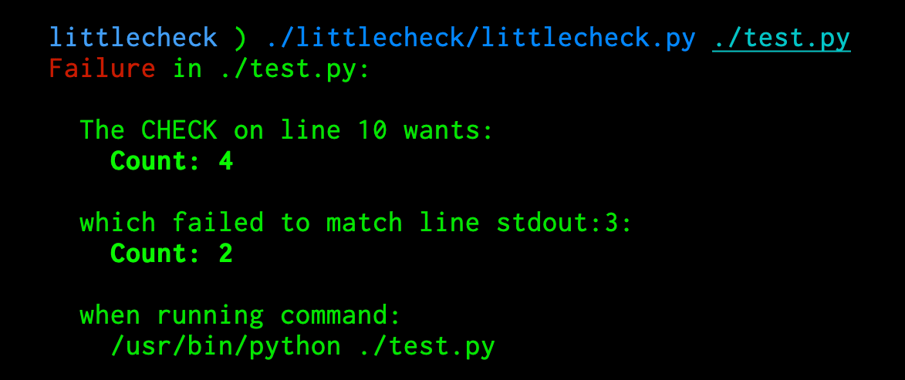
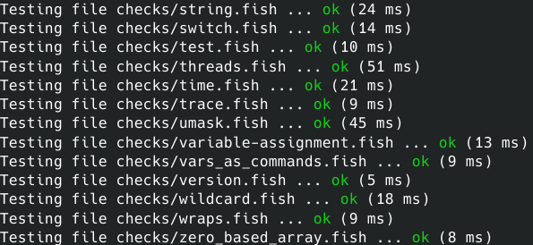
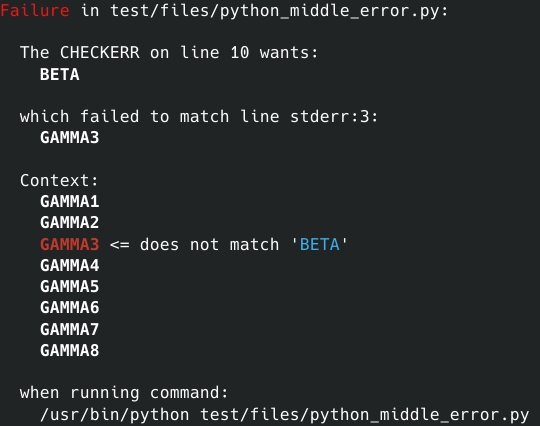

# littlecheck - command line tool tester

littlecheck is a tool for testing command line tools. It is heavily inspired by the [lit](http://llvm.org/docs/CommandGuide/lit.html) and [FileCheck](https://www.llvm.org/docs/CommandGuide/FileCheck.html) combo. littlecheck is much simpler: it requires only one Python file and has no dependencies except for Python itself (2.7 or 3).

littlecheck is aimed at programs which process a text file and produce output on stdout and/or stderr. A test file is processed by littlecheck, which reads special directives embedded in comments. The same file is processed by the tool under test, which ignores the comments. littlecheck then verifies the tool's output according to the directives.

# Screenshot





# Basic Example

An example test for the Python interpreter:

```python
# RUN: /usr/bin/python %s

print("abc") # CHECK: abc

print("%x"%(16**3)) # CHECK: 1000

for i in range(3):
    print(i)
# CHECK: 0
# CHECK: 1
# CHECK: 2
```

To run this:

    ./littlecheck/littlecheck.py test.py

littlecheck will parse out the special comments `# RUN` and `# CHECK`:

- `# RUN` specifies an arbitary shell command. `%s` is substituted with the path to the input file. 
- `# CHECK` specifies an expected output line. littlecheck verifies that the output of the shell command matches the sequence of `CHECK` lines.

If no `# RUN` command has been given, littlecheck will use a given shebang.

The special comments can occur at the beginning of a line, or anywhere in a line that does not start with `#`.

# Advanced Usage

littlecheck supports regular expressions, using Python's re syntax. Regular expressions are embedded in CHECK lines enclosed in double curly braces.

```python
# RUN: /usr/bin/python %s
print("A big number: ", 2**64)
# CHECK: A big number: {{\d+L}}
```

littlecheck also captures both stdout and stderr:

```ruby
# RUN: /usr/bin/ruby %s
$stdout.puts "this goes to stdout"
$stderr.puts "this goes to stderr"

# CHECK: this goes to stdout
# CHECKERR: this goes to stderr
```

To skip tests, littlecheck provides the `# REQUIRES` directive. Anything given there will be run as a shell command (with /bin/sh, with the substitutions applied), and if any REQUIRES returns non-zero the script will be skipped:

```shell
# RUN: /bin/sh %s
# Only run this test on macOS:
# REQUIRES: test $(uname) = Darwin
# Only run it if git is installed
# REQUIRES: command -v git
```

# Integrating littlecheck

To integrate littlecheck into your project, simply copy the file `littlecheck/littlecheck.py` into the appropriate place in your source tree. No other files are required.

# Tests

Run `make test` to run the tests.

# Limitations

- littlecheck currently only supports `#` comments. Other commenting styles would be straightforward to add.
- littlecheck does not yet support all substitutions of `lit`. It supports `%s` and `%%`, and custom ones via the `-s` option.
- littlecheck does not support the `CHECK` and `CHECK-NEXT` distinction. All lines are expected to be present, except that empty output lines are ignored.
- littlecheck permits leading whitespace on matching lines and does not yet support something like the `--strict-whitespace` option to FileCheck.

# License

littlecheck is released into the public domain. You may use it for any purpose without attribution, or under the [CC0](https://creativecommons.org/publicdomain/zero/1.0/) license if public domain is not available.
